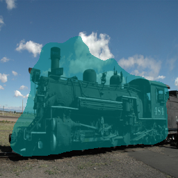
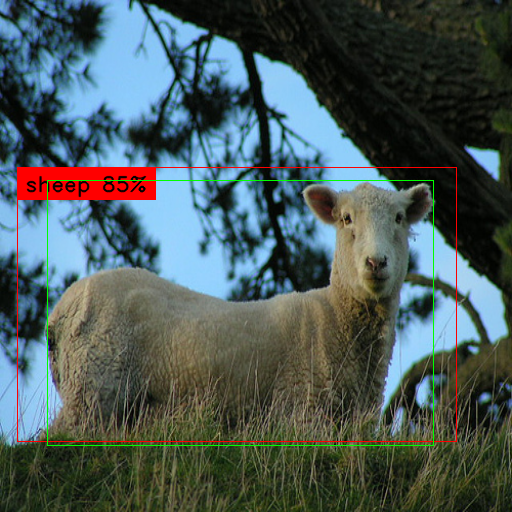

# deepext-with-lightning
Deep learning library/modules with PyTorch and PyTorch-Lightning.

<br/><br/>

## 注意点
- データセットが指定したディレクトリになかった場合はダウンロードされます。
- データセットはtorchvision.datasetで使う形式です。
    - tarファイルと設定用フォルダなど含まれます
    - 手動でダウンロードした場合は形式が異なる場合があるので、スクリプトから自動ダウンロードをおすすめします
- コマンドの使い方は以下のコマンドで見れます
```
python train_---_demo.py -h
```
<br/>

## Setup
```
pip install -r requirements.txt

PyTorch/torchvision is required separate installation(https://pytorch.org/)
```

<br/>

## Training
### classification
```
# Attention Branch Network
python train_classification_demo.py --progress_dir=progress\classification --dataset_root=<dataset directory> --model=abn --epoch=20 --lr=1e-5 --batch_size=8 --submodel=resnet34

# Customized backbone classification network
python train_classification_demo.py --progress_dir=progress\classification --dataset_root=<dataset directory> --model=customnet --epoch=20 --lr=1e-5 --batch_size=8 --submodel=resnet34

# mobilenet
python train_classification_demo.py --progress_dir=progress\classification --dataset_root=<dataset directory> --model=mobilenet --epoch=20 --lr=1e-5 --batch_size=8

# EfficientNet
python train_classification_demo.py --progress_dir=progress\classification --dataset_root=<dataset directory> --model=efficientnet --epoch=20 --lr=1e-5 --batch_size=8 --efficientnet_scale=1 
```
<br/>

### Segmentation
```
# ShelfNet
python train_segmentation_demo.py --moodel=shelfnet --submodel=resnet18 --dataset=voc2012 --dataset_root=<Pascal VOCデータセット2007のパス(tarファイル)> --progress_dir=<途中経過出力先ディレクトリ> 

# UNet
python train_segmentation_demo.py --moodel=unet --dataset=voc2012 --dataset_root=<Pascal VOCデータセット2007のパス(tarファイル)> --progress_dir=<途中経過出力先ディレクトリ> 

# ResUNet
python train_segmentation_demo.py --moodel=resunet --dataset=voc2012 --dataset_root=<Pascal VOCデータセット2007のパス(tarファイル)> --progress_dir=<途中経過出力先ディレクトリ> 
```

<br/>

### Object detection
```
python train_detection_demo.py --model=efficientdet --dataset=voc2012 --dataset_root=<Pascal VOCデータセット2012のパス> --progress_dir=<途中経過出力先ディレクトリ>
```


<br/><br/>


## Realtime prediction using USB camera
### Segmentation
```
python camera_demo.py --model=shelfnet --load_checkpoint_path=checkpoints/<checkpoint path> --image_size=512 --label_names_path=voc_label_names.txt
```

### Object detection
```
python camera_demo.py --model=efficientdet --load_checkpoint_path=checkpoints/<checkpoint path> --image_size=512 --label_names_path=voc_label_names.txt
```

### Classification
```
python camera_demo.py --model=customnet --load_checkpoint_path=checkpoints\<checkpoint path> --image_size=96 --label_names_path=stl_label_names.txt
```

### Classification with attention map
```
python camera_demo.py --model=abn --load_checkpoint_path=checkpoints\<checkpoint path> --image_size=96 --label_names_path=stl_label_names.txt
```

<br/><br/>


## Logging
```
tensorboard --logdir ./tensorboard_logs --port=12345
mlflow ui --port 12345
```

<br/><br/>

## Test
```
pytest --cov=deepext_with_lightning --cov-report=html
```

<br/><br/>

## Using model references
- ResNeSt
    - https://github.com/zhanghang1989/ResNeSt
- EfficientNet
    - https://github.com/lukemelas/EfficientNet-PyTorch
- EfficientDet
    - https://github.com/toandaominh1997/EfficientDet.Pytorch

## Training progress output

